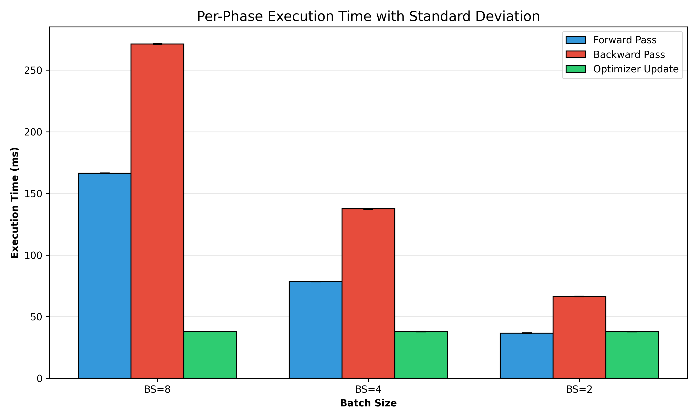
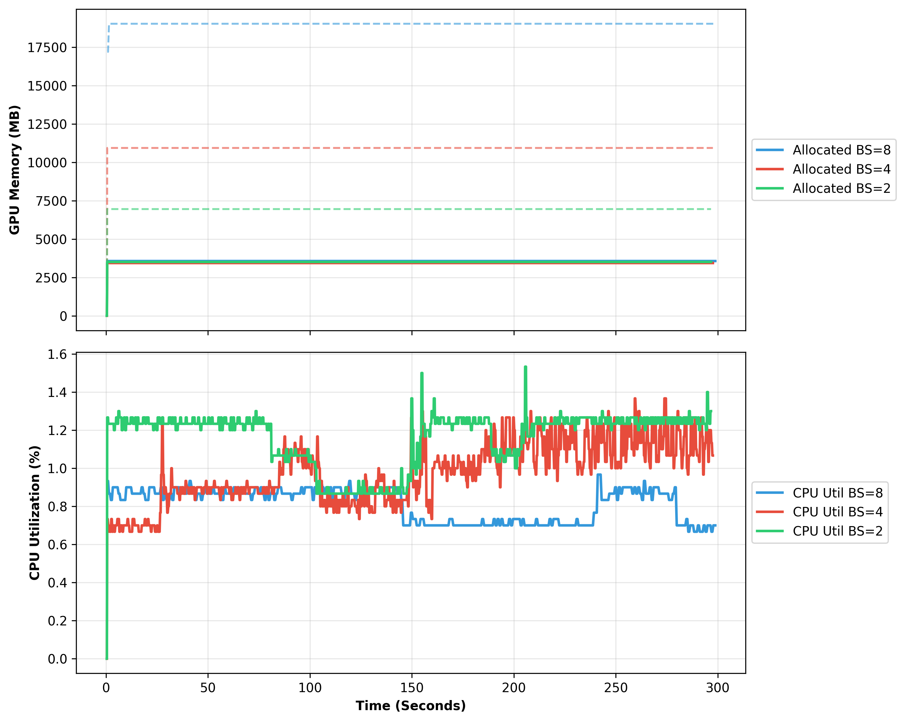
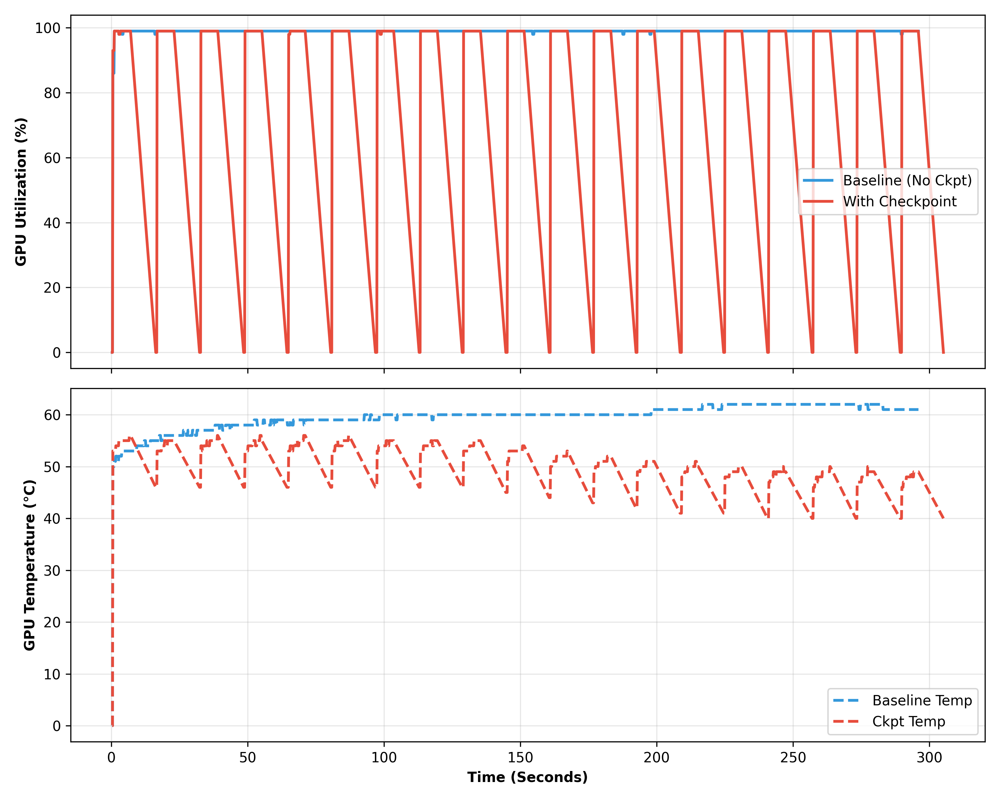
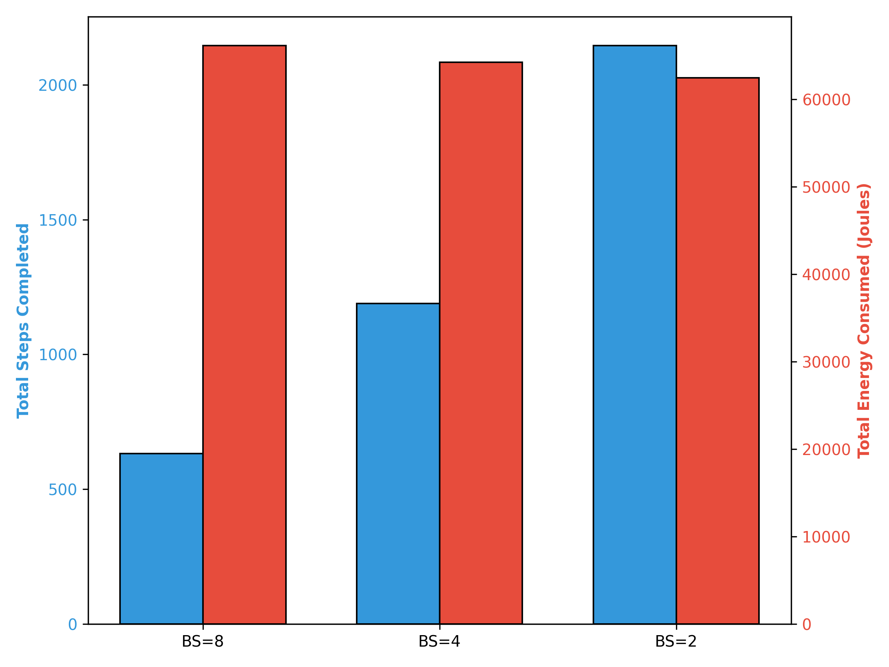

# ⚡ T5 Thermodynamic Profiling & Hardware Telemetry


A decoupled, phase-isolated hardware telemetry pipeline engineered to profile the thermodynamic efficiency, VRAM saturation, and CPU dispatch bottlenecks of HuggingFace T5 workloads. 

## 🚀 Overview
As machine learning models scale, tracking their energy footprint without introducing massive "observer effect" overheads is a critical systems challenge. Traditional hardware polling blocks execution threads and destroys asynchronous GPU pipeline speed.

This pipeline bypasses traditional measurement bottlenecks by employing a **phase-isolated profiling architecture**. It achieves a strictly bounded worst-case measurement overhead of **<3%** and demonstrates **"Zero Dark Time"** within the PyTorch execution graph, allowing for sub-millisecond precision when analyzing complex ML architectures.

## 🧰 System Architecture

The project is structured as a robust orchestration matrix designed for SLURM cluster environments:

* **The Orchestrator (`scripts/run_final_T5Bench.sh`):** A master execution script that automates the $3 \times 3$ experimental matrix across varying batch sizes, orchestrating baselines, CodeCarbon tracking, and forced I/O stalls.
* **Phase-Decoupled Profiler (`src/trainer/simple.py`):** Utilizes custom phase-flag guards to selectively inject `torch.cuda.synchronize()` barriers. This isolates measurement overhead strictly to the phase being evaluated (Forward, Backward, or Optimizer).
* **Throttled Telemetry (`src/trainer/stats/hardware.py`):** A custom hardware tracker that caches metrics and implements a $\ge 500$ms polling throttle to prevent NVML API queries from starving the main CPU thread.
* **PCIe Bypass (`src/data/synthetic/data.py`):** Leverages synthetic MilaBench datasets generated directly in system memory to completely bypass the PCIe bus, guaranteeing 100% GPU pipeline saturation during compute baselines.

---

## 📊 Key Empirical Findings

Testing conducted on an **NVIDIA RTX 5000 Ada Generation (32GB VRAM)** GPU yielded the following systems insights:

### 1. The $O(1)$ Optimizer Bottleneck
Smaller batch sizes disproportionately waste execution time and energy on fixed-cost parameter updates. At Batch Size 2, the GPU wastes nearly **28% of its 250W power budget** on the Optimizer phase, proving that maximizing batch size to the VRAM ceiling is a strict thermodynamic requirement.


### 2. VRAM Saturation Ceilings
Mapped the exact computation graph caching limits for a 220M parameter model, mathematically proving that Batch Size 8 is the absolute physical ceiling for a 32GB accelerator before inducing Out-Of-Memory (OOM) exceptions.


### 3. CPU Dispatch Inefficiency (Inverse Scaling)
Observed an inverse scaling law in CPU utilization. Because small batch sizes compute so quickly, they force the CPU to orchestrate and dispatch CUDA kernels at more than **3x the frequency** of maximized batch sizes, needlessly taxing logical cores.

### 4. I/O Checkpointing Vulnerability
Visualized severe thermal and utilization penalties induced by forced Checkpoint disk writes. Synchronized storage writes caused GPU utilization to plummet from >99% to 91.6%, physically cooling the hardware by 15°C as the compute pipeline stalled waiting for storage subsystems.


### 5. Macro Throughput vs. Energy
Scaling from Batch Size 2 up to the VRAM ceiling of Batch Size 8 boosts processing throughput and consequently drops the thermodynamic cost from ~14.9 Joules per sample down to ~12.6 Joules per sample.


---

## ⚙️ Installation & Usage

### Prerequisites
* SLURM Workload Manager
* Conda / Mamba
* NVIDIA NVML Drivers

### 1. Initialize the Environment
```bash
git clone [https://github.com/yourusername/T5-Thermodynamic-Profiling.git](https://github.com/yourusername/T5-Thermodynamic-Profiling.git)
cd T5-Thermodynamic-Profiling
source scripts/conda_init.sh
source scripts/env_setup.sh
```

### 2. Execute the Profiling Matrix
Dispatch the automated telemetry suite to the SLURM cluster:
```bash
sbatch scripts/run_final_T5Bench.sh
```

#### 3. Parse Hardware Logs & Generate Visualizations
Generate the comparative PNG plots from the raw hardware telemetry outputs:
```bash
python3 scripts/analysis/plot_paper_figures.py
```

## 📄 Documentation & Full Research
For a complete mathematical breakdown of the computation graph limits, hardware throttling methodologies, and thermodynamic trade-offs, refer to the full academic paper and presentation slides included in this repository:

👉 **[Read the Full Paper (PDF) - Sustainability in Systems Design](./paper/T5_Energy_Profiling_Dapalma.pdf)**
👉 **[View the Presentation Slides (PPTX)](./paper/T5_Workload_Analysis_Presentation%20FINAL%20-%20Raphael%20Dapalma.pptx)**
